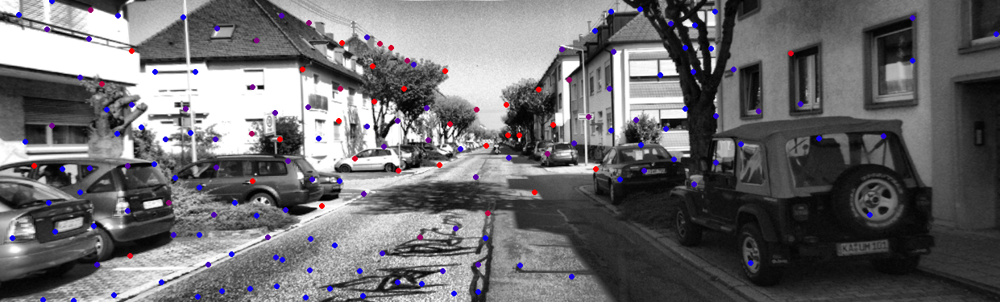
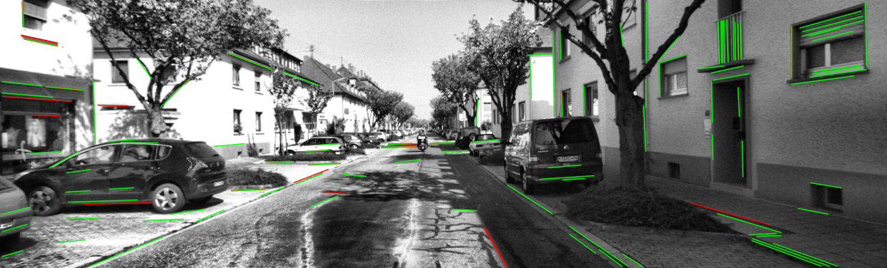

# **CIL-SLAM**
## 1、工程简介

**cil-slam**是相机-惯性测量单元-雷达紧耦合slam系统的简称，也是我硕士毕业的课题，目前为止完成度不高，要抓紧时间了！总体思想：参考lio-sam以因子图作为后端，添加imu预积分约束（同时高频imu测量辅助点云进行畸变去除和姿态预测）、雷达里程计约束、视觉里程计约束（3D-2D的匹配）。

## 2、视觉部分																													

以激光雷达帧构成的局部地图补全视觉特征的深度，视觉部分采用点特征以及线特征，前端特征提取与跟踪已经完成。代码上对vins-mono的光流跟踪节点以及Pl-vio的线特征跟踪节点进行了重构，采用ROS与功能类分离的设计，同时也提升了代码的可读性。

光流跟踪效果：

线特征匹配效果：

## 3、参考资源

感谢以下大佬的文章以及开源代码，没有他们的杰出工作，我们去哪搬砖呀：

- [Lio-sam](https://github.com/TixiaoShan/LIO-SAM)，Tixiao Shan小哥真的是年轻有为！
- [Lego-loam](https://github.com/RobustFieldAutonomyLab/LeGO-LOAM)
- [Vins-mono](https://github.com/HKUST-Aerial-Robotics/VINS-Mono)
- [Msckf-vio](https://github.com/KumarRobotics/msckf_vio)
- [Limo](https://ieeexplore.ieee.org/document/8594394)
- [Pl-vio](https://github.com/HeYijia/PL-VIO)

